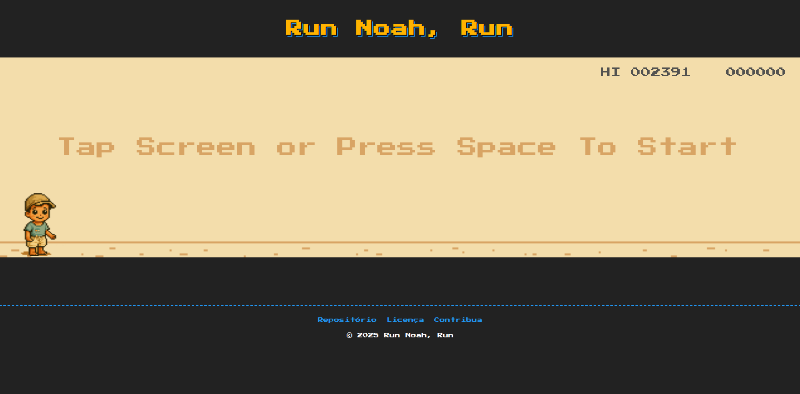

# 🕹️ Run Noah, Run

## A aventura começa quando a internet acaba!

Noah Run é um jogo endless runner inspirado no clássico T-Rex do Google Chrome, criado para ser jogado diretamente no navegador, sem necessidade de instalação ou dependências de backend. O objetivo é desviar de obstáculos, como cactos, e alcançar a maior pontuação possível. O projeto foi desenvolvido com foco em simplicidade, performance e visual retrô, utilizando apenas HTML, CSS puro e JavaScript.

Ideal para quem busca diversão rápida, aprendizado em desenvolvimento web ou deseja contribuir com melhorias e novas funcionalidades. Abra o arquivo `index.html` ou rode localmente para jogar!

<div align="center">
  
</div>

## ⚡ Stack Tecnológica

- **Linguagem**: Javascript
- **Estilização**: Pure CSS

## 🚀 Rodar localmente

Para rodar o Run Noah Run em ambiente local, basta utilizar o comando abaixo. Certifique-se de ter o Node.js (versão 18 ou superior) instalado:

```bash
npm install
npm start
```

O projeto será servido localmente usando a biblioteca `serve` instalada no próprio repositório. Acesse o endereço mostrado no terminal para jogar.

> **Recomendação:** Use Node.js versão 18 ou superior para melhor compatibilidade.

## Features

- 🎮 **Endless Runner Gameplay** - Jump over cacti and duck under birds
- 🎨 **Clean Pixel Art Style** - Retro aesthetic like the original

## Game Controls

- **Space Bar** or **Up Arrow** - Jump over obstacles

## 🏷️ Versionamento & Deploy

Este projeto utiliza um fluxo automatizado para versionamento e deploy:

1. **Pull Request (PR):**
   - Todo novo código deve ser enviado via PR para a branch `master`.
   - O workflow do GitHub Actions (`pr-checks.yml`) valida os commits (padrão Conventional Commits) e a formatação do código (Prettier).
   - O PR só pode ser aprovado se todos os checks passarem.

2. **Merge na master:**
   - Ao aprovar e fazer merge do PR na branch `master`, dois processos automáticos são disparados:
     - **Deploy na Vercel:** O projeto é publicado automaticamente na Vercel, tornando a nova versão disponível online.
     - **Versionamento automático:** O workflow (`release.yml`) executa o `semantic-release`, que:
       - Atualiza o changelog.
       - Incrementa a versão no `package.json`.
       - Cria e publica uma nova tag no repositório automaticamente.
       - Abre um Pull Request com as mudanças do changelog que precisa ser aprovado para refletir no repositório.

Esse fluxo garante rastreabilidade, organização e publicação contínua do projeto, sem necessidade de comandos manuais.

## 🤝 Como contribuir

Suas contribuições são muito bem-vindas! Para colaborar com o projeto de forma eficiente e seguindo nossas diretrizes, consulte o guia completo no [CONTRIBUTING.md](CONTRIBUTING.md). Lá você encontrará um passo a passo detalhado, padrões de commit, regras de validação e dicas importantes para garantir que sua contribuição seja aceita rapidamente.

## Créditos

O motor e a lógica do jogo foram adaptados a partir do excelente trabalho do repositório [dino-game](https://github.com/CodingWith-Adam/dino-game) criado por [CodingWith-Adam](https://github.com/CodingWith-Adam).

## 📜 Licença

Este projeto está sob a licença MIT. Veja o arquivo [LICENSE](LICENSE) para mais detalhes.
